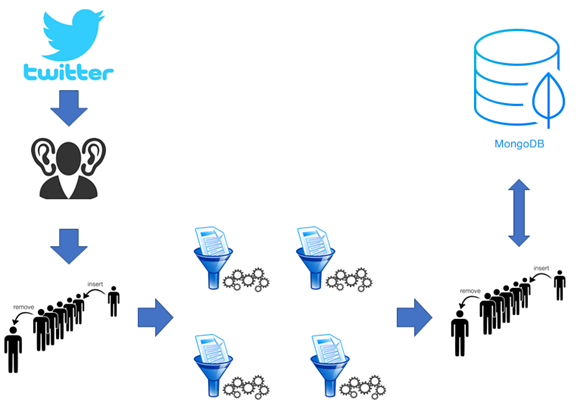

# Python Tweet Data Mining Bot

## What and why
This Tweet Mining Bot is designed with persistence and speed in mind, designed to be hosted and run completely in the cloud while saving any data you need to a Mongo DB NoSQL database (local or cloud) without the need to keep your machine endlessly grinding tweets for days on end. 

It can be used as a standalone product or used as a component part of a larger project that requires a stream and availability of Twitter data.
Basic functionality includes:

* Live stream tweets in the cloud for as long as your datastore allows.
* Ability to filter tweets based on any specified criteria not natively available in common Twitter Python wrappers.
* Separate multi-threaded filter workers to filter tweets from a queue while the stream listener gathers as many tweets as possible.
* Specify exactly what fields in the json tweet object you want saved to the DB.
* Ability to save tweets as a CSV on your local machine.

I wanted to be able to stream data without and having to keep my machine on for hours on end and wanted the ability to turn it on and off on-demand.

## Project Architecture

